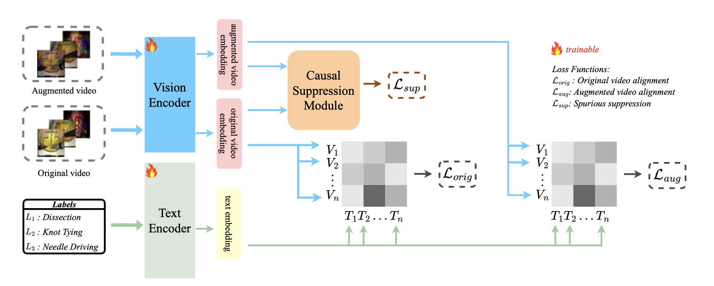

# CauCLIP: Bridging the Sim-to-real Gap in Surgical Video Understanding  Via Causality-inspired Vision-Language Modeling

[](https://arxiv.org/abs/2602.06619)


🚀 **Accepted at ICASSP 2026 (Oral) !**  

---

## Overview
We introduce a causality-inspired vision-language framework for surigal phase recognition under domain shift. Our approach integrates a frequency-based augmentation strategy to perturb domain-specific attributes while preserving semantic structures, and a causal suppression loss that mitigates non-causal biases and reinforces causal surgical features. On the SurgVisDom hard domain adaptation benchmark, CauCLIP achieves state-of-the-art performance with 0.642 Weighted F1, 0.487 Unweighted F1, 0.708 Global F1, and 0.651 Balanced Accuracy, outperforming prior approaches.

<p align="center">

</p>

For more detailed about our pipeline, please refer to our paper.

---

## Requirements

```
Python==3.8   torch==2.1  
```

---

## Datasets

**Extract frames from each video**

- For each surgical video, create a folder named after the video.  
- Store all frames (`.jpg` or `.png`) of that video inside the folder.

Example:
```
data/
├── video_001/
│ ├── 0001.jpg
│ ├── 0002.jpg
│ ├── ...
├── video_002/
│ ├── 0001.jpg
│ ├── 0002.jpg
│ ├── ...
```

**Create training lists**

- In the `lists/` directory, create `.txt` files to specify the dataset split.
- Each line in a `.txt` file should contain:
```
<path> <num_frames> <label>
```

Example:
```
data/video_001 128 0
data/video_002 64 1
```

where:

- `<path>`: relative path to the video frame folder  
- `<num_frames>`: total number of frames in the folder  
- `<label>`: ground-truth class label for the video

## Training
To train the model, use the following command:
```
python train.py
```

## Model

| Model | Dataset | Download |
|------|------|------|
| CauCLIP | <u>[SurgVisDom](https://www.synapse.org/surgvisdom2020)</u> | <u>[Google Drive](https://drive.google.com/drive/folders/16tUKTz7HZsRybWmN63D9fap9AtNz11VB?usp=drive_link)</u> |
---

## 📝Citation & Contact

```
@article{he2026cauclip,
  title={CauCLIP: Bridging the Sim-to-Real Gap in Surgical Video Understanding via Causality-Inspired Vision-Language Modeling},
  author={He, Yuxin and Li, An and Xue, Cheng},
  journal={arXiv preprint arXiv:2602.06619},
  year={2026}
}
```

For any inquiries or feedback, don’t hesitate to contact yuxinhe@seu.edu.cn.
